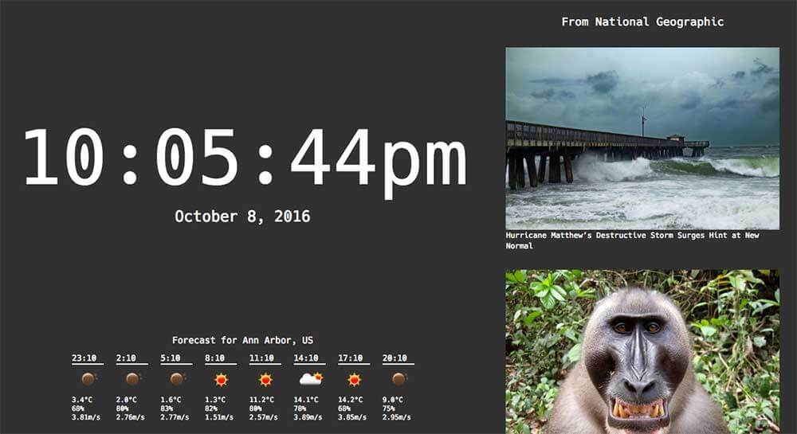

# Chrometab

A new tab replacement, for the Chrome browser.

### Features

##### Time
Time and date on the left side.

##### News
Everytime you open a new tab, a randomly selected news source is chosen, and news from that source is put in the news column.

### Setup
You will need to get two free API keys - one from NewsAPI, and the other from OpenWeatherMap. Put them in `js/json/secrets.json`.

### Development
`npm start` to build the package, most of which is in `extension/`.
