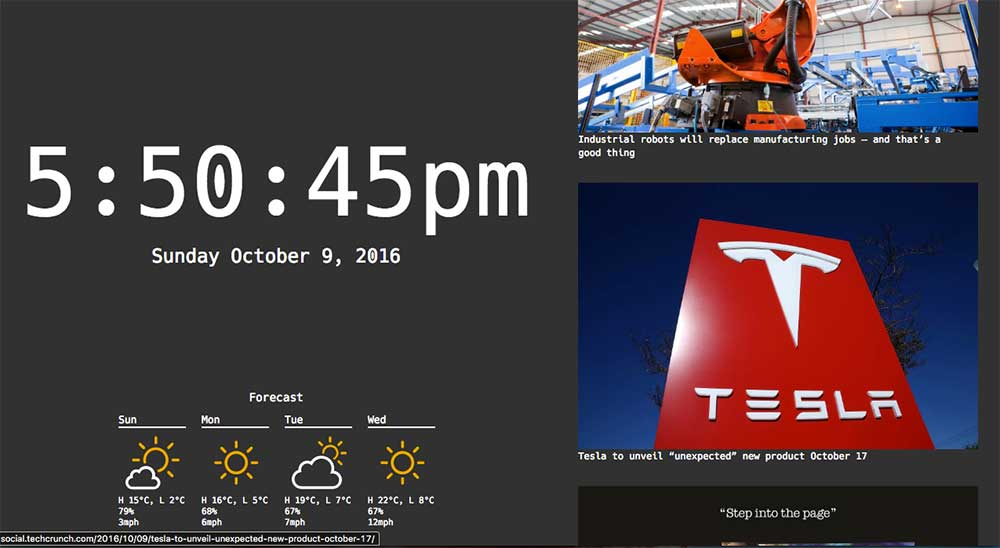

# Chrometab

A new tab replacement, for the Chrome browser.

### Features

##### Time
Time and date on the left side.

##### News
Everytime you open a new tab, a randomly selected news source is chosen, and news from that source is put in the news column.

### Setup
You will need to get two free API keys - one from NewsAPI, and the other from Weather Underground. Put them in `js/json/secrets.json`.

### Development
`npm start` to build the package, most of which is in `extension/`.

### Release
For Chrome, you can just load in an addon from source.

In Firefox, you need to sign the addon to use it in Beta and Stable releases, so you need to get an `addons.mozilla.org` API key. Set these to the env variables `$AMO_JWT_ISSUER` and `$AMO_JWT_SECRET`. Then run `npm run firefox-sign`. The release .xpi file will be in the `build` folder.
